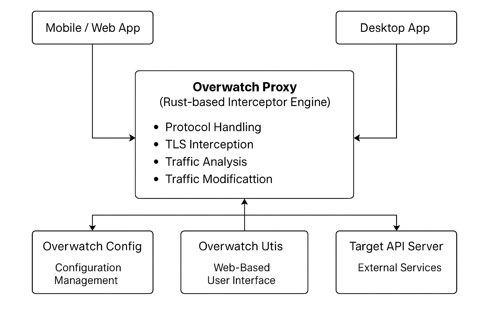

# 🛡️ Overwatch

**Overwatch** is a cutting-edge, high-performance, cross-platform network interceptor written in Rust. Built for developers, testers, and security analysts, it provides deep visibility and control over network traffic in real-time — whether HTTP, HTTPS, or beyond.

---

## ✨ Features

- 🔎 Man-in-the-middle (MITM) proxy engine
- 🔐 TLS/HTTPS interception with custom CA using `rustls`
- 📡 Real-time request/response inspection
- 🧠 Rule-based traffic modification and filtering
- 🖥️ Optional UI dashboard (in Rust WebAssembly)
- 📁 Logging, capture, and replay capabilities
- ⚙️ Modular plugin-based architecture

---

## 🧭 Architecture Overview

The architecture is designed for modularity and performance. Traffic flows from any client app (mobile/web/desktop) through the Overwatch Proxy where it can be intercepted, inspected, modified, and forwarded to the backend services.



| Module            | Functionality                                                  |
|------------------|----------------------------------------------------------------|
| **Overwatch Proxy** | Core engine: TLS interception, traffic analysis/modification |
| **Overwatch Config** | Dynamic configuration (runtime reloads, rulesets, CA setup) |
| **Overwatch Utils** | Shared utilities for parsing, logging, tracing                |
| **Overwatch UI**     | Optional Web UI dashboard (built with Yew/Leptos)            |
| **Target API Server** | Any external backend/server that receives proxied requests  |

---

## 📦 Project Structure

| Module            | Description                                                  |
|------------------|--------------------------------------------------------------|
| `overwatch-core`   | Core proxy engine with packet analysis and TLS MITM         |
| `overwatch-config` | Dynamic configuration system with hot-reload support        |
| `overwatch-utils`  | Shared utilities, common types, and helpers                 |
| `overwatch-ui`     | Optional web-based UI (via Leptos/Yew)                      |
| `tests/`           | End-to-end and integration tests                            |
| `scripts/`         | CA cert setup scripts                                       |

---

## 🚀 Getting Started

### 1. Clone and build

```bash
git clone https://github.com/veeringman/overwatch.git
cd overwatch
cargo build --release
```

### 2. Generate and trust CA certificate (for HTTPS interception)

```bash
chmod +x scripts/setup_cert.sh
./scripts/setup_cert.sh
```

> 🛡️ This creates a local root CA (CRT + KEY) for intercepting HTTPS traffic securely.  
> ⚠️ You must trust the root cert manually in your OS or test device.

---

## ⚙️ Example Usage (CLI)

```bash
cargo run -p overwatch-core -- --port 8080 --tls
```

### Supported CLI options (WIP):
- `--port`: Port to intercept (default: 8080)
- `--tls`: Enable TLS MITM
- `--config <file>`: Load external YAML/JSON config
- `--log-level`: Debug, Info, Warn, Error

---

## 📊 Use Cases

- 🧪 Debugging mobile and web applications
- 🛠️ Simulating degraded or malformed responses
- 🛡️ Security testing, vulnerability discovery
- 🧬 Learning and teaching network protocols
- 🧰 Internal development tooling for QA/dev teams

---

## 🧩 Coming Soon

- 🌐 Full Web UI with request timeline, filters, replay
- 🔌 Plugin engine for traffic rules, payload rewriting
- 📁 PCAP and HAR exports
- 📊 Stats dashboard (Prometheus/OpenTelemetry support)

---

## 🛠️ Technologies Used

- 🦀 Rust (with `tokio`, `hyper`, `rustls`)
- 🧱 Modular Cargo workspaces
- 📦 Async-friendly architecture
- 🌐 Optional WASM UI (Yew/Leptos/Tauri)

---

## 📜 License

MIT License © 2025 Veer Man Inc.

---

## 🤝 Contributing

PRs, feedback, and suggestions are welcome!  
Please open an issue to discuss major features before submitting.

